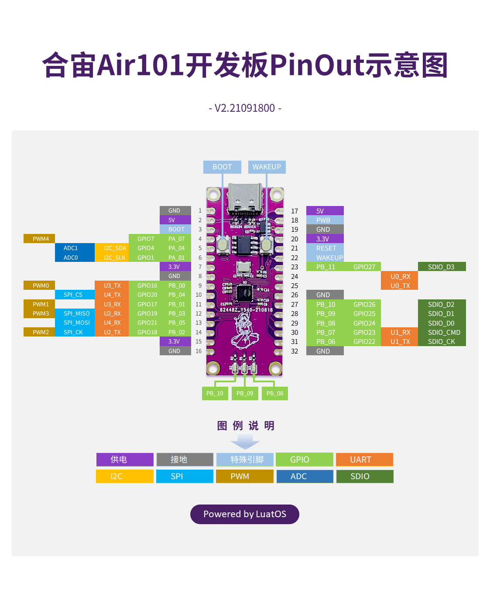
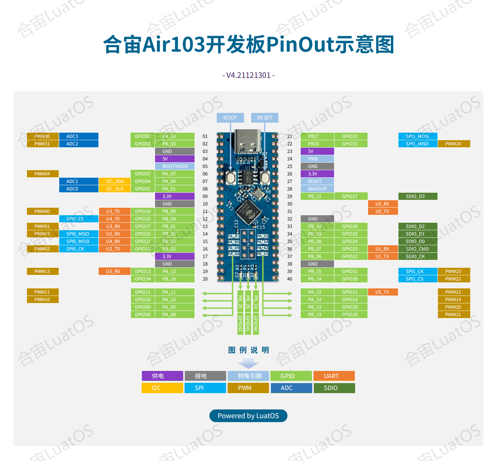

# hardware_luatos_air10x

Lua 教程：https://www.bilibili.com/video/BV1vf4y1L7Rb/

Refer: https://wiki.luatos.com/

#### board_air101

https://wiki.luatos.com/chips/air101/index.html

`air103` 的芯片就是 `w800`。

#### 

#### board_ari103

https://wiki.luatos.com/chips/air103/index.html

`air103` 的芯片就是 `w806`。

#### board_ari105

